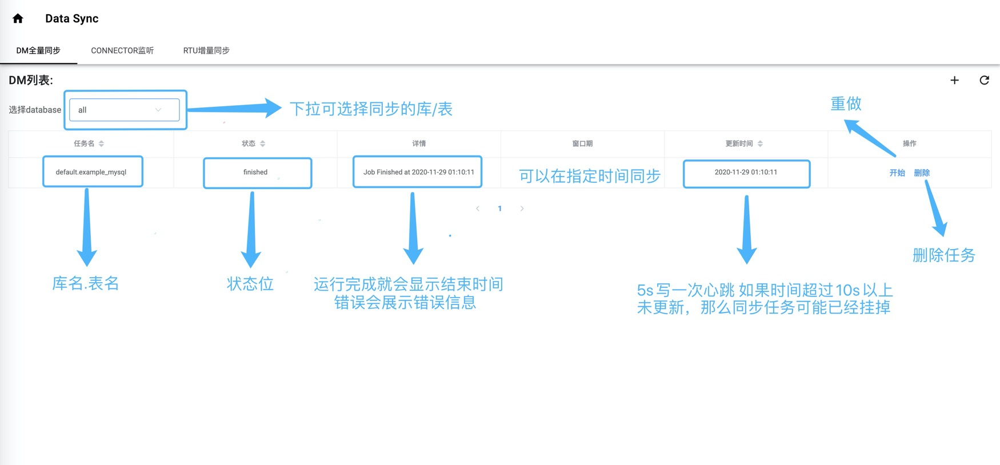
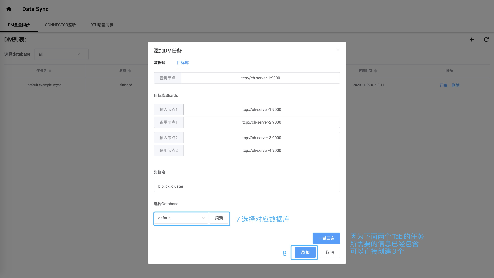

# Galaxy控制台简介

本模块基于[go-zero](https://github.com/tal-tech/go-zero)构建，是一个简洁的数据同步后台管理系统。

简单来说，它可以很方便的在Clickhouse建表、全量同步数据和增量同步数据。

### 下面阐述主要功能及使用：

#### 1.用户管理

​	用户是存在Mysql数据库galaxy库的user表内，默认给出的用户名密码是admin@email.com和123456

用户登录/注册功能将在后期加入，暂时可以通过直接操作表来实现。用户登录需要校验Token（一个小时的有效期）。

#### 2.DM全量同步模块

列表页面：

新增页面：

#### 3.Connector创建模块

​	该模块使用上和DM任务创建并无太大区别，因此不做过多介绍。 主要实现方式是调用canal的api接口写入配置文件。

#### 4.Rtu增量同步模块

​	该模块的使用也比较简单，但是需要注意的是，在表引擎非Replacing MergeTree 时需要等DM全量同步完再开启，防止重复数据。

