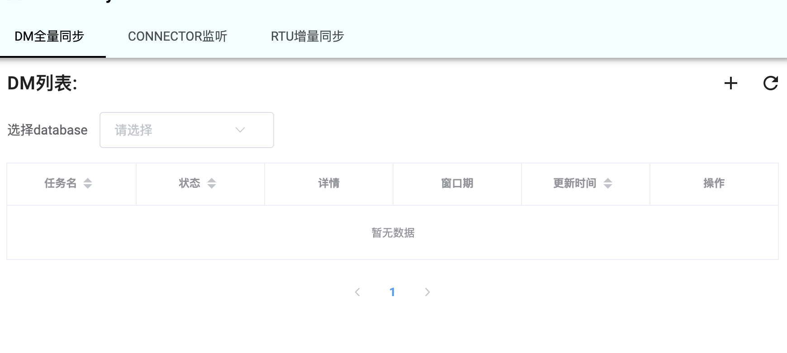
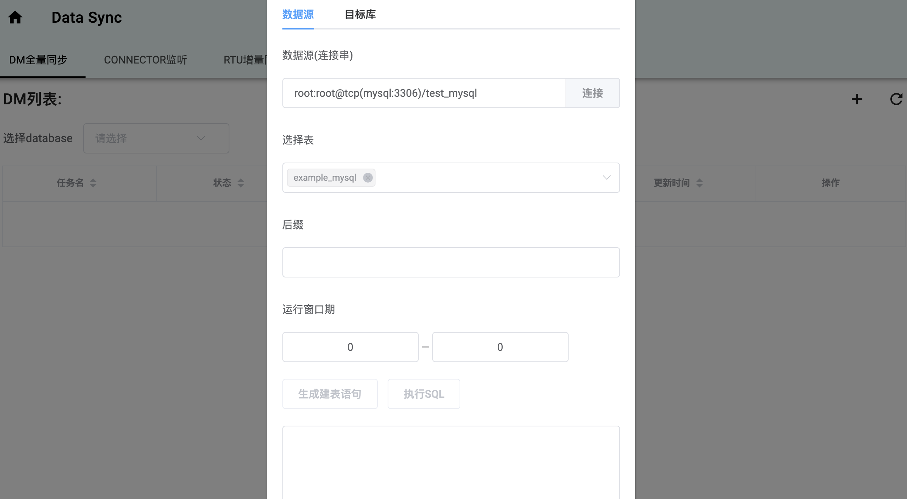
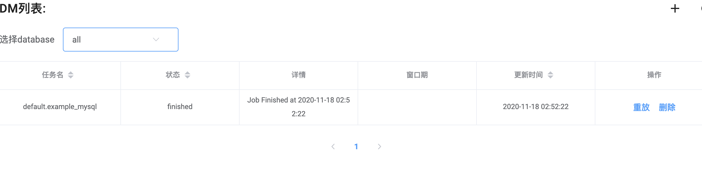
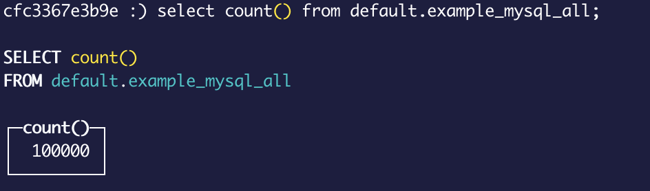
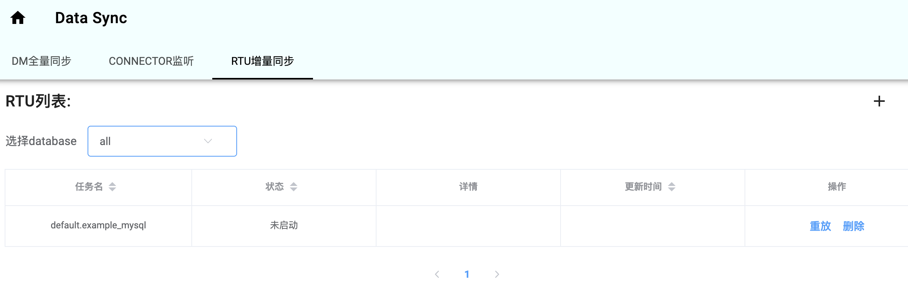
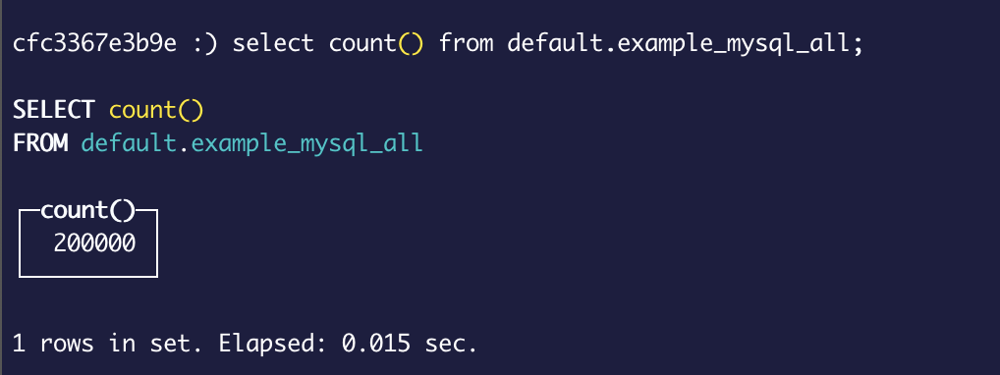

# start up

```bash
git clone https://github.com/tal-tech/cds.git
cd cds
make up
```

构建结束后，注意检查是否有 container 异常退出。

点击 http://localhost:3414/cds.html 打开控制台，如图



使用下面的账户和密码登录
```
user: admin@email.com
password: 123456
```

## 单次全量同步:
```
1. 点击右上角 "+"
2. MySQL  输入连接串 root:root@tcp(mysql:3306)/test_mysql
或
MongoDB 输入连接串 mongodb://mongo1:30001/test_mongo
3. 点连接
4. 选择表,如默认的 example_mysql (MySQL) 或 example (MongoDB)
5. 点击"目标库"，
6. 点刷新 
7. 选择同步至Clickhouse 的schema（"default"）
8. 切换回"数据源"，点击 "生成建表语句"
注意：根据需要选择 partition 字段，这里 'PARTITION BY toYYYYMM()' 可删除，或 替换成 'PARTITION BY toYYYYMM(dt)'
9. 点击 "执行SQL" ，下方弹出执行成功
10. 点击 "添加"，下方弹出执行成功
```




### 查看任务状态
刷新页面,选择数据库，如图



### 在 Clickhouse 中确认数据



## 开启实时增量同步

以mysql为例
```
1 点击“CONNECTOR监听”
2 点击右上角“+”
3 MySQL  输入连接串 root:root@tcp(mysql:3306)/test_mysql
4 点击 “添加”
5 点击 "RTU增量同步"-"重放"使之启动
6 点击右上角“+”
7 MySQL  输入连接串 root:root@tcp(mysql:3306)/test_mysql
8 点击 “添加”
```
刷新页面


### 验证增量更新
再次执行初始化数据库脚本，可再次插入100000条数据。

```
cd sit/docker/
sh ./init.sh
```

验证clickhouse中的mysql的增量数据：



## 清理
要清理所有上面启动的docker容器还原初始状态可以

```
cd cds
make down
```

仅清理

```
cd cds
make docker_clean
```
