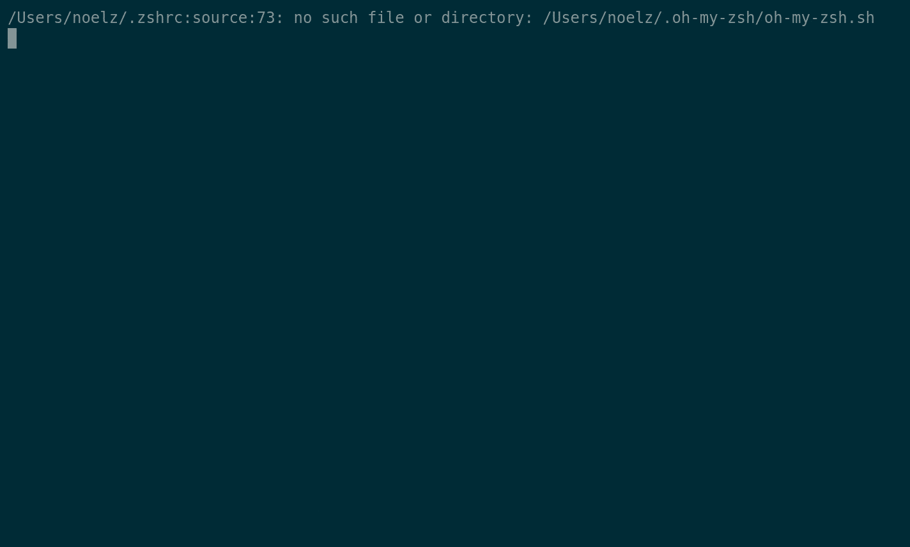

# CkGroup
[clickhouse-go](github.com/ClickHouse/clickhouse-go) 的封装 

目的是操作 ClickHouse 集群内的多个节点


## 特性

* 插入时在代码层面做 hash , 防止 ClickHouse 的分布式表负担过大
* 插入失败时有重试机制 
* 查询结果自动转为 struct

## 快速体验 ckgroup
该命令依赖 `docker` , `docker-compose` , `golang` 
```shell
./demo.sh
```

运行效果 : 



## 例子

具体参考 `examples` 目录下的代码

### insert

```golang
imports....

func main() {
	var c = config.Config{
		ShardGroups: []config.ShardGroupConfig{
			{ShardNode: "tcp://localhost:9000", ReplicaNodes: []string{"tcp://localhost:9001"}},
			{ShardNode: "tcp://localhost:9002", ReplicaNodes: []string{"tcp://localhost:9003"}},
		}}
	
	group := ckgroup.MustCKGroup(c)

	var args [][]interface{}
	for _, item := range generateUsers() {
		args = append(args, []interface{}{item.Id, item.RealName, item.City})
	}

	err := group.ExecAuto(`insert into user (id,real_name,city) values (?,?,?)`, 0, args)
	if err != nil {
		fmt.Println(err)
	}
}

```


### query

```golang
improt....

type user struct {
	Id       int `db:"id"`
	RealName string `db:"real_name"`
	City     string `db:"city"`
}

func main() {
	var c = config.Config{QueryNode: "clickhouse dns url"}
	group := ckgroup.MustCKGroup(c)

	datas := &[]*user{}
	err := group.QueryRows(datas, `select id, real_name, city from user where  city = ?`, "上海")
	if err != nil {
		fmt.Println(err)
		return
	}
	for i := range *datas {
		fmt.Println((*datas)[i])
	}
}
```


## TODO

- [ ] 流式查询
- [ ] 改进 Insert 的易用性
- [ ] 改为接口实现 , 方便 test mock
- [ ] 等等


